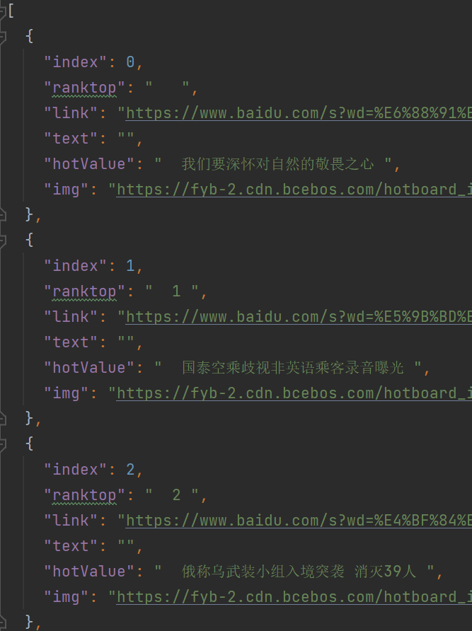
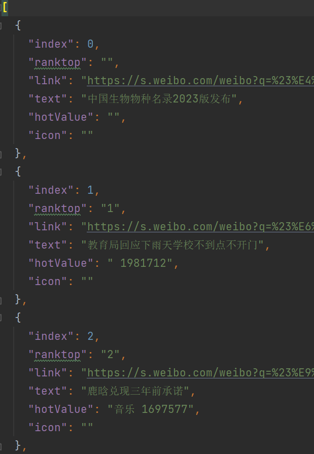
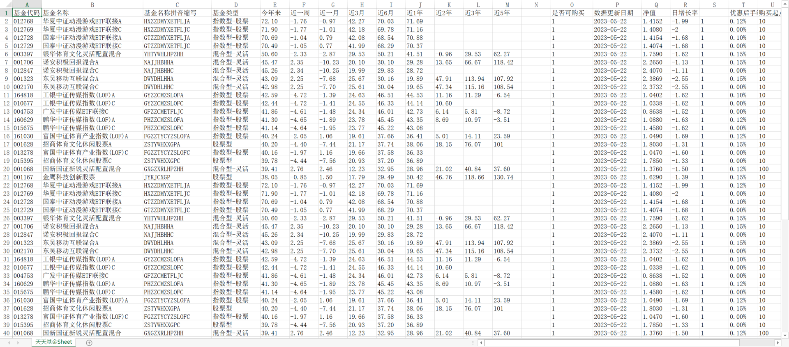
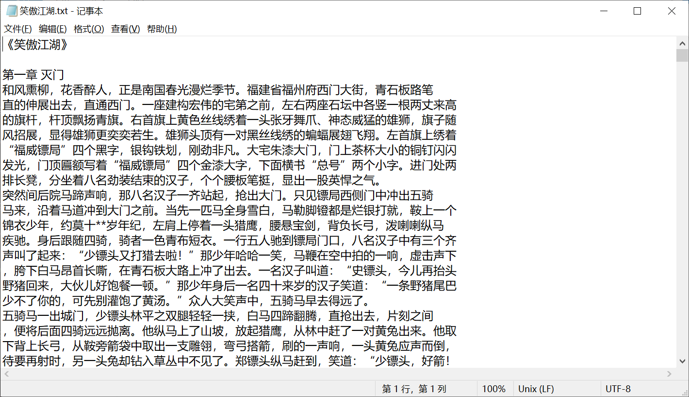

<h2 align="center">Nodejs爬虫程序集</h2>

<p align="center">
  
</p>

### 项目简介

本项目是基于nodejs实现的一系列爬虫程序集合，将一些有用或有趣的数据爬取下来。

如果你觉得程序有趣，请给我一个star✨，你的支持是我的动力。后续我将增加其他有趣的爬虫程序。如果你也有比较好的想法或者程序，欢迎PR!

### 程序实现

#### 1. 爬取美女图片

我们通过**爬取接口的方式**实现获取数据并下载图片保存到本地。

* 设置接口相关参数(通过axios)；
* 通过接口获取数据(这里是图片的url)；
* 将图片下载到本地(通过download)；

对于这个美女网站我们可以直接爬取接口来获取图片url，然后将图片保存。结果如图：


完整源代码请看 `src/beauty.js`。

#### 2. 爬取微博/百度热搜

有的网站并不是通过接口的方式来获取数据，比如服务端渲染的页面。这时我们可以通过**页面解析的方式**来爬取数据。

- 百度热搜

像百度热搜，我们通过分析页面DOM结构可知热搜数据位于 `.theme-hot[theme="realtime"] .list_1EDla a` ，通过 `cheerio` 框架来使用选择器获取热搜文案及其他数据。
然后可以直接使用nodejs 内置工具函数 `fs.writeFileSync` 来将数据保存到本地。结果如下：



可以运行 `npm run baidu-hot` 然后在 `static/baidu_realtime_hot.json` 查看。

- 微博热搜

有些网站为了防爬虫加了一些校验，如微博热搜需要设置 `Cookie`。一般来说比较简单，我们F12查看可以通过分析看文件请求 `Request Headers` 字段是否有校验字段，通常是cookie和token这种。
可以对微博热搜设置headers来通过校验。结果如下：



可以运行 `npm run weibo-hot` 然后在 `static/weibo_realtime_hot.json` 查看。

> cheerio作为选择器使用要处理，cheerio.load(res.data)。具体使用请看：https://github.com/cheeriojs/cheerio

#### 3. 天天基金

同样的，这个程序也是通过**抓取接口形式**来爬取数据。

* 通过axios获取接口数据;
* 并对获取到的数据做处理，将会得到 `var rankData ={ /.../ }` 形式数据;
* 使用 `node-xlsx` 将[[str, str, str], [str, str, str]]形式数据转换为buffer;
* 将buffer通过fs模块下载到本地，这里是指定了下载位置到 `/static`;



源码请看 `src/tiantian-fund.js`。

#### 4. 国家统计局

通过**爬取接口的方式**获取相应的数据，并生成xlsx文件。这里我爬取了 `国民经济核算最近6季度的数据`。


#### 5. 高清素材

通过**爬取接口的方式**获取相应高清图片素材，这个网站有token校验，要自己登录获取相应字段值 `Sentry-Trace` 和 `Cookie`。


#### 6. 4k高清壁纸

通过**页面分析的方式**获取相应高清壁纸。


#### 7. 电子小说下载

使用 `puppeteer` 模拟浏览器手动操作，可以将自己想要下载的电子小说下载到本地。

> 文件 `book.js` 中Line22,executablePath字段为自己电脑本地chrome安装路径；Line119, 参数配置小说名字和作者名字，其中作者名字可以不写，但是下载的是搜索到的第一个结果；



后续可以自己将下载的小说导入到阅读器或应用中。

### 项目本地预览

### Clone repo

```bash
git clone --depth=1 https://github.com/Zuojiangtao/nodejs-spider.git my-project
cd my-project
```

#### 安装依赖

```shell
yarn install
```

#### 运行爬虫指令

```shell
yarn beauty // 爬取美女图片

yarn weibo-hot // 爬取微博热搜

yarn baidu-hot // 爬取百度热搜

yarn tiantian-fund // 爬取天天基金筛选数据

yarn national-data // 爬取国家统计局经济核算数据

yarn pexels // 爬取高清素材图片

yarn netbian // 爬取4k高清壁纸

yarn book // 爬取电子小说
```

### 其他

#### 下载文件的模块

1. 可使用内置模块 'fs' ;
2. 使用第三方插件 'node-downloader-helper' ;
3. 使用第三方插件 'download' ;

#### 获取数据模块

1. 如果node版本17.5.0以上，可以使用fetch模块;
2. 使用axios、request、superagent等第三方插件;
3. 使用内置模块 'http';

#### 其他依赖及模块推荐

1. 一款轻量级nodejs爬虫工具：[node-crawler](https://github.com/bda-research/node-crawler);
2. 一个验证码相关工具：[node-tesseract](https://github.com/desmondmorris/node-tesseract);
3. 爬虫定时爬取：[node-schedule](https://github.com/node-schedule/node-schedule);
4. 将markdown文件转成PDF文件：[markdown-pdf](https://github.com/alanshaw/markdown-pdf);
5. xlsx：[node-xlsx](https://github.com/mgcrea/node-xlsx);
6. csv：[node-csv](https://github.com/adaltas/node-csv);
7. 模拟用户在浏览器中进行的多种操作和行为: [puppeteer](https://puppeteer.bootcss.com/);
8. 其他依赖资源汇总：[awesome-nodejs](https://github.com/sindresorhus/awesome-nodejs);
